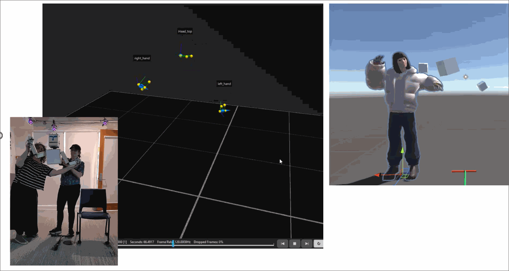
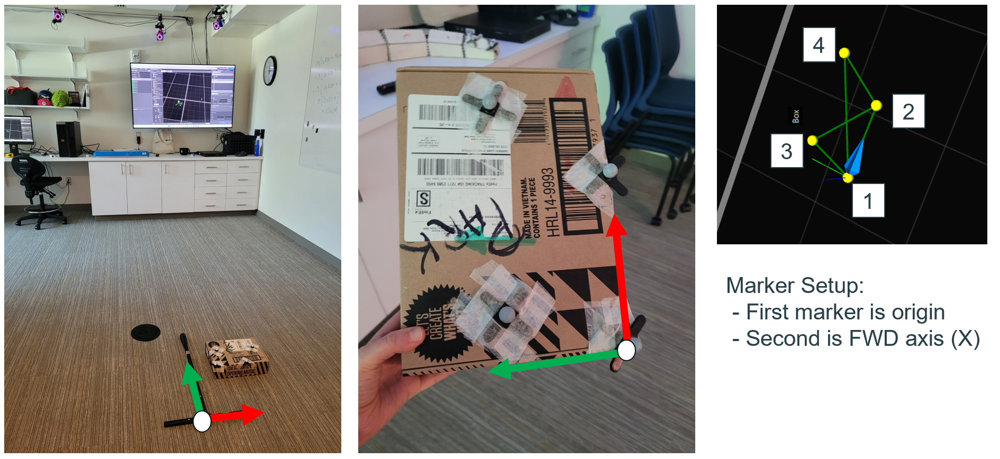
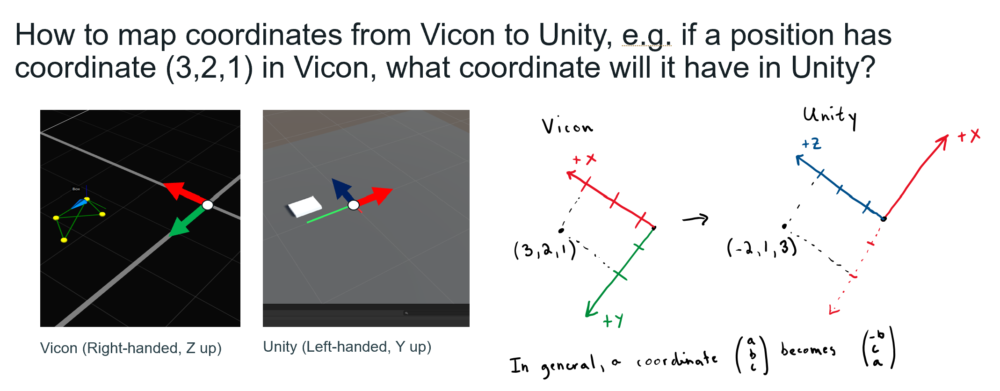
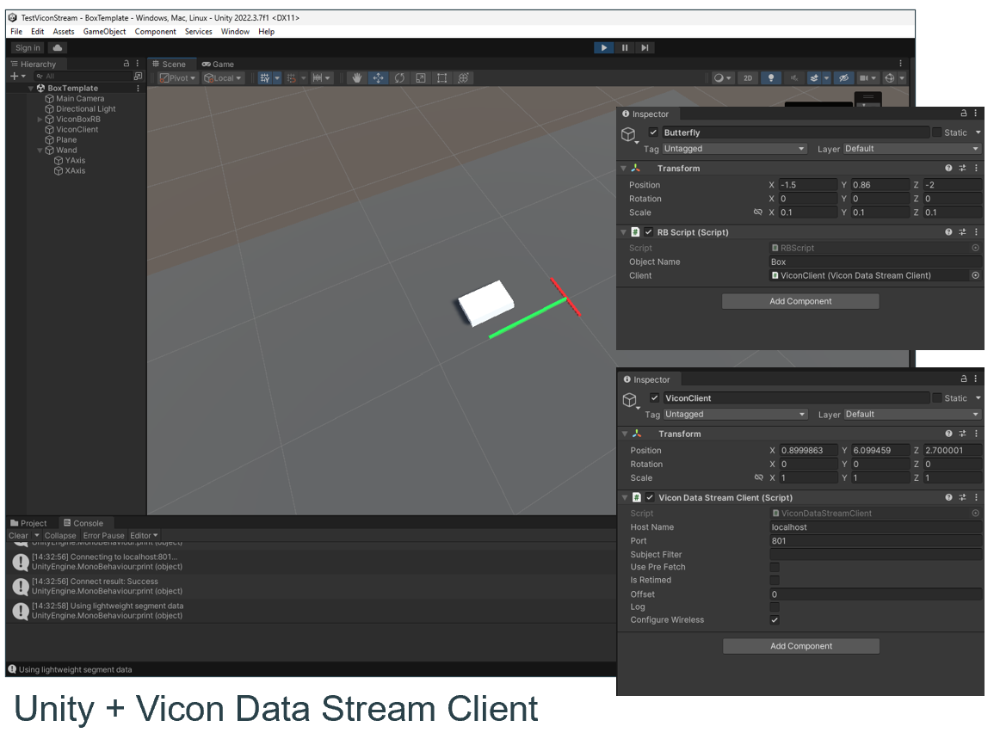

# Virtuality Puppets

A virtuality puppet links a physical puppet with a virtual counterpart. This repository contains 

* laser cutter patterns for making physical puppets and
* Unity projects and assets for making virtual counterparts.



We created three projects that use virtuality puppets to help students develop skills for working with frames of reference and animating characters.  In the first project, students setup a mapping between our motion capture space and the virtual environment. In the second and third, students track the motion of physical puppets, such as a tentacle or Muppet, and retarget the motion to different virtual characters. Each project reinforces lecture material about transformations, coordinate systems,

This work was presented at the SIGGRAPH 2026 _Educator's Forum_ as an Engaging Education Techniques and Assignments (EETA).

```
Aline Normoyle and Bronwen Densmore. 2026. Developing spatial reasoning skills using virtuality puppets. 
In Special Interest Group on Computer Graphics and Interactive Techniques Conference Educator’s Forum (SIGGRAPH Educator’s Forum ’26), 
July 19–23, 2026, Los Angeles, CA, USA. ACM, New York, NY, USA, 3 pages.  
https://doi.org/10.1145/3799829.3812518
```

Acknowledgments 

We wish to thank our students who participated in our first Virtuality Theater seminar – Neha Thumu, Gavin Sears, Yue Chen, Paprika Chen, Joon Luther, and Kylie McCombs– and to Stephen H. Lane whose animation course inspired this activity.

## Getting Started

These projects were built and tested with Unity 6 and a Vicon Motion Capture System (8 cameras). The Vicon streaming API (included) streams the tracked puppets into Unity in real-time. 

### Setting up props

In Vicon, four markers are needed to specify an oriented rigid body for tracking. When configuring the object, the user selects each marker in order and then gives the prop a name in Vicon Live. The order that markers ate selected determines its coordinate system. 

* The first marker is the origin
* The second marker is the forward direction (X)

Below is an example based on our lab and a simple box prop with its origin on the bottom corner of the object.



### Configuring the Unity scene

The Vicon coordinate system is right-handed with Z up. The Unity scene is left-handed with Y up. In our setup, the front of the room is positive Y, which corresponds to negative X in Unity. We convert between coordinates as follows.



To set the size of our Unity objects to match the lab, we measured the lab space (12 feet by 18 feet) and our props. The box, for examples, is 12 inches by 8.5 inches by 3 inches. Vicon coordinates are in meters, so we convert these values to meters and then transform the coordinates. For example, 

* A plane, whose base size is 10 x 10 units, should be scaled to (0.549, 1, 0.366) to match our lab
* A box, which base size is 1 x 1 x 1 units, should be scaled to (0.22, 0.076, 0.33) to match our prop

The scene `UnityProject/Assets/Scenes/BoxTemplate.unity` implements the above setup. Vicon streaming is enabled by creating an object with a `ViconDataStreamClient` component. Then, when you add a `RBScript` onto a gameobject, the gameobject's movement will be driven by the corresponding Vicon prop. 



## License

This work is released under the creative commons license. If you find this work helpful or you expand upon it, let us know. 
